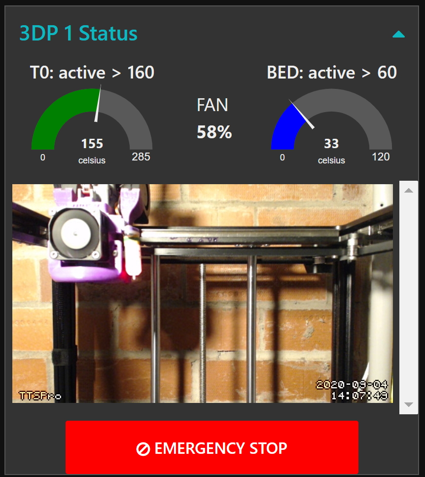
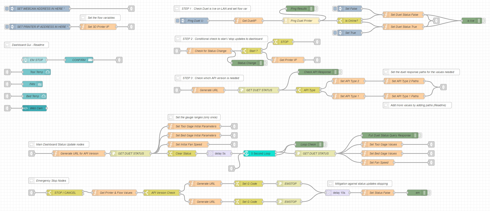

# Duet-Node-Red-Dashboard

This is a simple mobile formatted node red dashboard that can be used to monitor Duet RRF based printers running Duet Web Control.

The "Duet Dashboard Universal.json" is a deployable example which has been designed to automatically detect the Duet API version required to talk with the 3D Printer.
To get this working in your node-red instance the following steps are needed.  

Install into your palette:  
    * node-red-contrib-looptimer2  
    * node-red-configurable-ping  
    * node-red-dashboard (see http://flows.nodered.org/node/node-red-dashboard for usage instructions)  

Within the flow update the 2 inject nodes with the printer and web cam information requested.

Assign the Dashboard GUI nodes to your dashboard group configuration.

*************************

The other example flow is for refernce purposes only, and will require much more work to deploy in your environment, it demonstrates the following functions:  

* Powers on a RPi & 3d Printer(s) via MQTT and a tasmota wifi pwr socket(s).  
* Queries 2 3d Printers (with 2 different duet api versions) for status information every 15 seconds including:  
    *  Current Bed Temp  
    *  Current HotEnd Temp  
    *  Current Enclousure Temp (only implemented for 1 printer)  
* Displays the webcam streams montioring each printer 
* Allows a target enclousure temp to be set and automatically turns on/off a heater via MQTT and tasmota wifi pwr socket.  
* Safely shutsdown the RPi remotely using "sshpass" to remotely send shutdown command to the RPi (you will need to change this cmd to meet your environments details)  
* Emergency Stop Button

Notes:  
Two different methods for getting the data from the Duet RRF are to accomodate the version diffferences between 2 Duet API Versions.

The flows are not optimised.

This is only provided for reference purposes. You should review everything before deployment.  

A short instructional video:  
[
