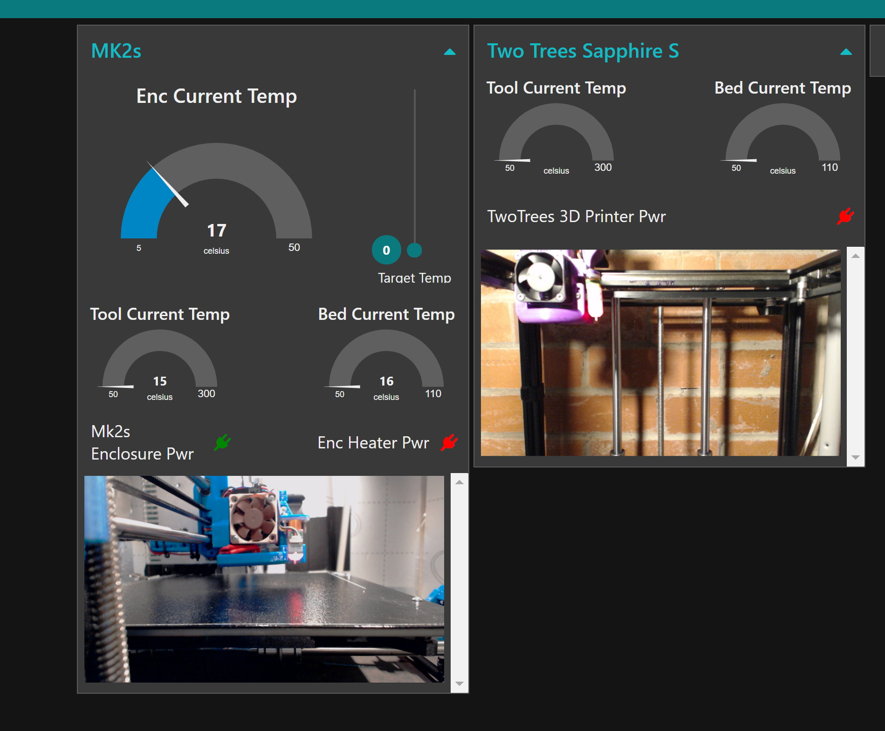

# Duet-Node-Red-Dashboard

This is a simple mobile formatted node red dashboard that I use as a simple live status monitor for 2 3d printers. 

The flow achieves the following functions:  

* Powers on a RPi & 3d Printer(s) via MQTT and a tasmota wifi pwr socket(s).  
* Queries both 3d Printers (running Duet RepRap Firmware) for status information every 15 seconds including:  
    *  Current Bed Temp  
    *  Current HotEnd Temp  
    *  Current Enclousure Temp (only implemented for 1 printer)  
* Displays the webcam streams montioring each printer 
* Allows a target enclousure temp to be set and automatically turns on/off a heater via MQTT and tasmota wifi pwr socket.  
* Safely shutsdown the RPi remotely using "sshpass" to remotely send shutdown command to the RPi (you will need to change this cmd to meet your environments details)  
* Emergency Stop Button

Notes:  
Two different methods for getting the data from the Duet RRF are used for completeness. One method works for RRF + Duet2 the other will only work with RRF deployed with a companion SBC.

2 flows are provided. One is abstracted from my live home automation dashboard and cleaned up for reference only. The other is a direct copy from the live dashboard.

The flows are not optimised.

The flow uses the following addtional pallete nodes:  

node-red-contrib-looptimer  
node-red-dashboard  

This is a work in progress and is only provided for reference purposes. You should review everything before deployment.